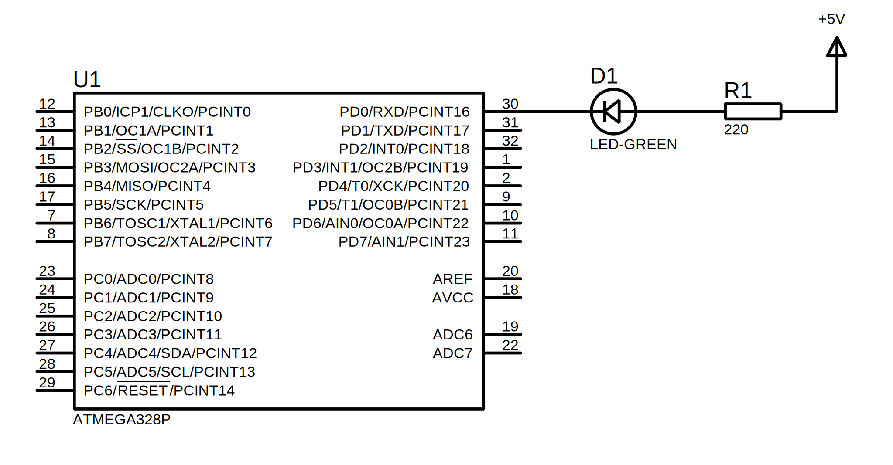
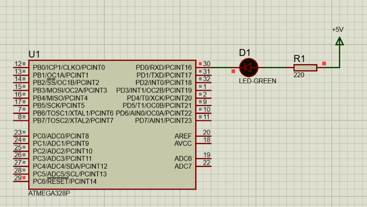
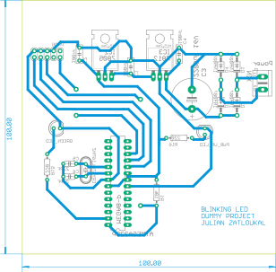

# Dummy project about a blinking LED. 
* Toggles every 500mS.
* Based on the ATmega328P microcontroller. 
* Coded in C, compiled in avr-gcc, and written using the Atmel Studio IDE.
* Printed Circuit Board designed in Eagle (EDA).
* Simulated in Proteus VSM.

### Simulation
<p align="center">
  
  
</p>

### Main routine
```c
#define F_CPU 16000000
#include <avr/io.h>
#include <util/delay.h>

int main(void)
{
	DDRD |= (1<<0);
	while (1) 
	{
		PORTD ^= (1<<0);
		_delay_ms(500);
	}
}
```

### Circuit schematic
<p align="center">
  
</p>

### PCB Top view
<p align="center">
  
</p>

### PCB Bottom view
<p align="center">
  
</p>
