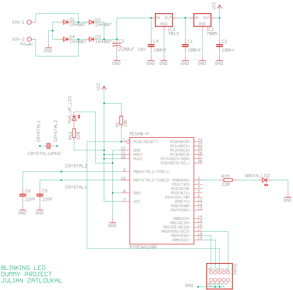
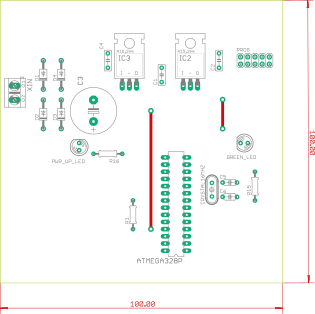

# Dummy project about a blinking LED. 
* Toggles every 500mS.
* Based on the ATmega328P microcontroller. 
* Coded in C, compiled in avr-gcc, and written using the Atmel Studio IDE.
* Printed Circuit Board designed in Eagle (EDA).
* Simulated in Proteus VSM.

### Simulation

  
  

### Circuit schematic

  

### PCB Top view

  

### PCB Bottom view

  

